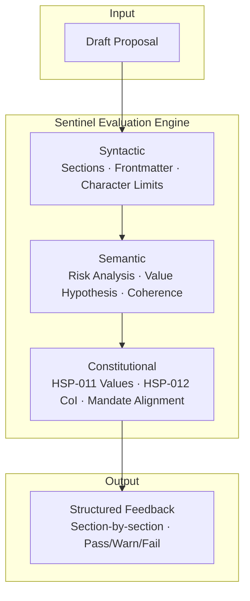
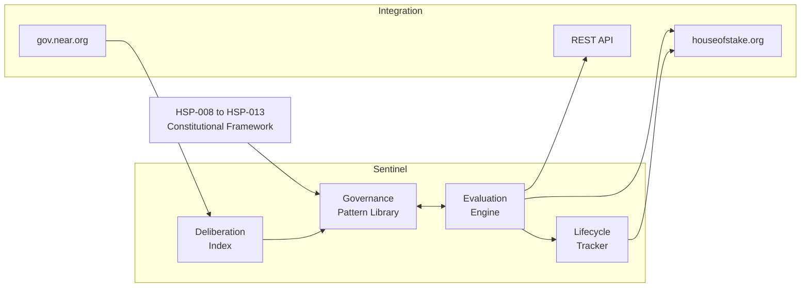
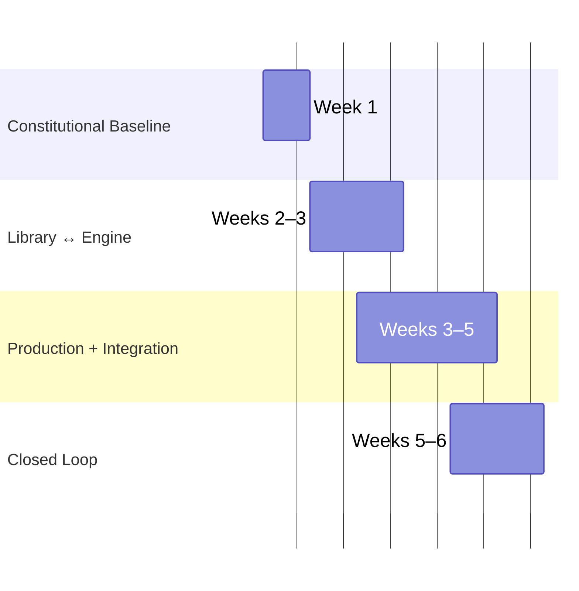

<figure class="scriptorium-figure">
  
  <figcaption>The Screening Lattice</figcaption>
</figure>

```
hsp: XXX
title: Sentinel Governance Screening Engine
description: AI-native proposal evaluation system that encodes HoS constitutional requirements as evaluable patterns
author: Elco / Elementary Complexity (elementarycomplexity.com)
discussions-to: TBD
status: Draft
track: Decision
type: Simple Majority
category: Technical Governance
stakeholders: NEAR tokenholders, Screening Committee, House of Stake Delegates, Proposal Authors, Head of Governance
created: 2026-05-12
requires: HSP-008, HSP-009
```

## Abstract

Sentinel is a governance-native proposal evaluation system for the House of Stake. It encodes the constitutional framework (HSP-008 through HSP-013) and the HSP template requirements as machine-evaluable patterns, then evaluates draft proposals against those patterns before formal submission. Proposal authors receive structured, section-by-section feedback: compliance status, specific deficiency identification, and concrete revision guidance, so they can fix problems before the HSP Editor or Screening Committee ever sees the document. Sentinel automates the formal compliance check, preserves committee capacity for substantive evaluation, and builds a growing governance pattern library that improves with every proposal cycle. All outputs are published under CC0 1.0.

I wrote about this approach in [Rigorously Joyful — Notes on Active Institutional Memory](https://www.elementarycomplexity.com/writing/rigorously-joyful).

## Payload

Sentinel Governance Evaluation System — CC0 1.0 Public Good

Upon completion, the following artifacts will be published under CC0 1.0 as permanent public goods:

1. **Governance Pattern Library.** A machine-readable knowledge base encoding all evaluable requirements from HSP-008 through HSP-013 and the HSP-009 Article 6 template specification, organized using a typed pattern taxonomy with pass/warn/fail evaluation criteria and revision guidance.

2. **Evaluation Engine.** A production system that accepts draft proposals, evaluates them against the pattern library at multiple levels (syntactic, semantic, constitutional), and returns structured, section-by-section feedback with concrete revision guidance. Semantic analysis powered by NEAR AI Cloud.

3. **Lifecycle Tracker.** Stage-aware constitutional guidance across all HSP lifecycle stages, integrated with houseofstake.org. Includes deadline awareness for feedback periods and voting windows.

4. **Deliberation Index.** A deliberation analysis system that extracts patterns from proposal outcomes and feeds them back into the pattern library, creating an institutional learning loop that accumulates value over time.

All deliverables, including source code, evaluation criteria, pattern data, and documentation, are available for any community member or organization to use, modify, fork, and distribute without restriction.

## Context

House of Stake Season #1 launched April 2026. The constitutional framework is ratified, the Screening Committee is active, and proposals are being submitted under a demanding 17-section HSP template. HoS has launched a dedicated governance platform at houseofstake.org with structured proposal creation, status tracking, and on-chain voting.

The review process works in two stages: an HSP Editor performs formal compliance checking, and the Screening Committee evaluates substantive alignment with the HoS mandate. HoS leadership has signaled interest in AI-assisted governance tooling, and the platform roadmap has previously included plans for automated proposal analysis. Sentinel delivers that capability.

The template is rigorous by design. Enforced character limits, mandatory RACI matrix with exactly one Accountable party per activity, End-to-end Value Hypothesis with three sub-sections, binary success criteria on milestones. Only one non-constitutional proposal (HSP-007) has completed the full lifecycle from submission to execution. The system is still establishing its norms. This is a good moment to consider a quality layer that shapes institutional behavior before volume scales.

## Problem

Three problems compound when HoS scales:

**Author Information Asymmetry.** Proposal authors face a 17-section template with no structured feedback before formal submission. They discover deficiencies only after the HSP Editor reviews, consuming editorial time that could be avoided entirely with pre-submission self-checking. This is not just "work hours" wasted - this is weeks of implementation delay in the fastest evolving competitive landscape that has ever happened.

**HSP Editor Bottleneck.** The HSP Editor performs format compliance checking manually: verifying character limits, confirming section completeness, validating frontmatter correctness, checking RACI structure. This is systematic, pattern-based work that scales linearly with proposal volume. As HoS grows, the bottleneck tightens. The Screening Committee should focus on substantive evaluation, not format compliance. Agents will be writing proposals soon. Sooner if NEAR is successful. The input layer will possibly face uncapped scale, the processing surface needs to mount a defence.

**Institutional Memory Loss.** Every proposal that passes or fails deliberation generates governance intelligence. Which budget formats survive delegate scrutiny? Which milestone structures get challenged? Which rhetorical patterns build consensus? Today, this intelligence lives in comment threads and in committee members' heads. When someone rotates out, it's gone. And people will rotate, this is a DAO, after all.

## Approach

Sentinel treats the HSP template as a formal governance grammar. A valid proposal must parse against this grammar at multiple levels. Structural compliance, semantic coherence, constitutional alignment.

Community proposals like the Governance Memory System have explored institutional memory from the archival side — cataloging decisions, tracking outcomes, documenting participation. That's valuable work. Sentinel operates at a different layer entirely. It doesn't archive governance history. It encodes constitutional requirements as machine-evaluable patterns — a formal grammar that can parse whether a proposal structurally satisfies the rules before a human ever reads it. Sentinel does possibly output a library, but what we are building is more akin to a compiler.

### Pattern Language Methodology

The HSP template encodes governance patterns. Each required section, each formatting convention, each rhetorical norm represents a pattern learned through institutional experience. Sentinel makes these patterns explicit and machine-evaluable, covering structural, rhetorical, budget, and precedent dimensions.

### Formal Validation

Evaluation operates at three levels. *Syntactic:* does the proposal contain all required sections, does the frontmatter parse, are character limits respected? *Semantic:* does the Security Considerations section identify real risks or contain boilerplate? Does the Value Hypothesis connect coherently? *Constitutional:* does the proposal align with ratified HSP-011 values? Does it satisfy HSP-012 CoI requirements?




### What Sentinel Is Not

Sentinel doesn't replace the Screening Committee. It doesn't vote, approve, or reject proposals. It provides structured quality feedback before formal submission, so proposals that reach the Committee are format-compliant and substantively stronger. The Committee retains full authority over all screening decisions

This outperforms the usual alternatives:
- *Manual author guidelines:* Already exist (HSP-009 Article 6). Insufficient. Guidelines tell you what to include; they don't tell you if you've done it correctly.
- *General-purpose AI evaluation:* Can't encode governance intelligence accumulated from institutional deliberation. These patterns exist in no public dataset and no foundation model's training data.

Sentinel evaluates against documented patterns and constitutional requirements. It can't assess political viability, strategic timing, or the interpersonal dynamics of delegate consensus-building. Those remain the domain of human judgment.

<figure class="scriptorium-figure">
  
  <figcaption>Pattern Language</figcaption>
</figure>

## End-to-end Value Hypothesis

This proposal delivers complete, standalone value by producing a CC0-licensed governance pattern library that encodes 100% of HoS constitutional requirements as evaluable rules, and a production evaluation engine, integrated with the existing HoS platform, that identifies ≥90% of template compliance issues before formal submission. All deliverables are permanent public goods independent of the applicant's operational continuity.

### Objective

Deliver a production governance evaluation system that encodes the HoS constitutional framework as machine-evaluable patterns, provides structured proposal feedback to authors before submission, integrates with houseofstake.org, and builds a governance pattern library that improves with every proposal cycle.

### Outcome

- Screening Committee spends less time on format compliance and more time on substantive governance evaluation
- Proposal authors receive concrete feedback before submission, reducing preventable rejections
- HoS develops institutional memory that persists beyond individual committee members
- The governance quality bar rises as authors benchmark against quantified evaluation criteria
- System tends towards order - the more it's used, the more it learns about itself.

### Dependencies

- Ratified constitutional framework — [HSP-008](https://gov.near.org/t/hsp-008-near-house-of-stake-constitution/42018), [HSP-009](https://gov.near.org/t/hsp-009-near-house-of-stake-proposals-and-voting-procedures/42019), [HSP-010](https://gov.near.org/t/hsp-010-near-house-of-stake-screening-committee-charter/42020), [HSP-011](https://gov.near.org/t/hsp-011-near-house-of-stake-mission-vision-values/42052), [HSP-012](https://gov.near.org/t/hsp-012-near-house-of-stake-conflict-of-interest-policy/42055), [HSP-013](https://gov.near.org/t/hsp-013-near-house-of-stake-code-of-conduct/42050) — all ratified
- HSP template specification (HSP-009 Article 6) — ratified
- Existing proposal corpus — [gov.near.org/c/house-of-stake/proposals](https://gov.near.org/c/house-of-stake/proposals/168) — publicly available

Screening Committee feedback on pattern library accuracy is desirable for validation, but all core deliverables are independent of committee participation and can be built using the public constitutional corpus alone.

## Key Performance Indicators (KPIs)

| KPI | Target | Measurement |
|-----|--------|-------------|
| HSP template requirement coverage | ≥95% of documented requirements encoded as evaluable patterns | Audit of pattern library against HSP-009 Article 6 |
| Known issue detection accuracy | ≥90% of compliance issues in existing proposals correctly identified | Retrospective evaluation against known deficiencies |
| Author revision effectiveness | Measurable score improvement between draft iterations | Score delta tracking across revisions |
| Screening Committee time on format compliance | Reduction reported by committee members | Qualitative feedback survey at Milestone 3 |
| Proposal quality trend | Upward trend in average evaluation scores over 6-month period | Longitudinal score tracking |
| Pattern library growth | ≥3 new deliberation analyses added per quarter | Count of new pattern entries from proposal outcomes |

## Technical Specification

### Methodology

Sentinel applies two established intellectual traditions to governance evaluation.

Christopher Alexander's *A Pattern Language* (1977) showed that design quality emerges from structured libraries of named patterns, each encoding a recurring problem, its context, and its solution. The HSP template is exactly such a pattern language. Sentinel makes its patterns explicit and machine-evaluable.

LangSec (Language-theoretic Security, established by Meredith Patterson and Sergey Bratus) holds that any system processing input is an interpreter, and input validation is a language recognition problem. The HSP template *is* a formal grammar. Proposals that fail to parse against it consume institutional attention without producing governance value.

I wrote about this approach in [Rigorously Joyful — Notes on Active Institutional Memory](https://www.elementarycomplexity.com/writing/rigorously-joyful).

### Architecture

Four components, designed to integrate with the existing HoS governance platform:

1. **Governance Pattern Library.** Structured, versioned knowledge base encoding evaluable rules from HSP-008 through HSP-013. Each pattern links to its constitutional source, carries pass/warn/fail criteria, and includes revision guidance.

2. **Evaluation Engine.** Accepts draft proposals, parses against the pattern library at three levels (syntactic, semantic, constitutional), returns section-by-section feedback with revision guidance and precedent comparisons. Semantic analysis via NEAR AI Cloud.

3. **Lifecycle Tracker.** Models the six-stage HSP lifecycle with stage-specific guidance, revision history, and deadline awareness (7-day feedback minimum, 7/14-day voting windows per HSP-009 §7).

4. **Deliberation Index.** Analyzes deliberation outcomes and feeds findings back into the pattern library. This is the compounding mechanism: evaluation quality grows with every proposal cycle.




### Integration Model

Sentinel is an evaluation module, not a standalone platform. It's designed to fit into the existing houseofstake.org proposal creation and review flow, providing self-check functionality within proposal creation and augmenting the HSP Editor's formal review.

- **houseofstake.org:** Primary integration surface within the proposal creation pipeline
- **gov.near.org:** Deliberation history ingestion for deliberation index
- **REST API:** Documented endpoints for programmatic access

### Data Handling

All proposal data processed is already public. No private data collected. Pattern library and evaluation criteria published openly (CC0). Individual scores visible only to the submitting author unless they choose to publish.

### Technology Stack

TypeScript/Python evaluation engine. NEAR AI Cloud for semantic analysis (TEE-secured). EU-based hosting (GDPR-aligned). Designed for embedding within houseofstake.org.

<figure class="scriptorium-figure">
  
  <figcaption>Library vs Compiler</figcaption>
</figure>

## Backwards Compatibility

Sentinel introduces no changes to existing governance processes, smart contracts, or constitutional documents. It's an optional, pre-submission quality layer. Authors who don't use Sentinel submit proposals through the identical process they use today. The Screening Committee's authority and decision-making power are unchanged.

## Security Considerations

### Evaluation Integrity
The pattern library and evaluation criteria are published openly. Authors can verify the constitutional basis for each evaluation rule. No opaque scoring.

### Gaming Risk
Proposals could be crafted to score highly without genuine quality. Sentinel explicitly separates structural compliance (machine-verifiable) from substantive evaluation (committee judgment). A high Sentinel score means format compliance, not strategic merit. The Screening Committee retains full authority over substantive assessment.

### Data Privacy
All input data is already public. No PII collected beyond what authors publish on gov.near.org.

### Availability
Sentinel is optional. If the service is unavailable, the governance process continues without interruption. No governance function depends on Sentinel's uptime.

### Pattern Library Accuracy
Constitutional amendments could make patterns outdated. Mitigation: patterns are versioned with explicit links to their constitutional source documents. Amendment events trigger review cycles.

## Stakeholders

Single Accountable party per activity: Elco (Elementary Complexity).

| Activity | Responsible | Accountable | Consulted | Informed |
|----------|-------------|-------------|-----------|----------|
| Pattern library development | Elementary Complexity | Elco (EC) | Screening Committee, @AK_HoG | HoS Delegates, HSP Editors |
| Evaluation engine development | Elementary Complexity | Elco (EC) | — | Screening Committee, @AK_HoG |
| Constitutional alignment validation | Elementary Complexity | Elco (EC) | @AK_HoG, HSP Editors | Screening Committee |
| HoS platform integration | Elementary Complexity | Elco (EC) | @AK_HoG, HoS platform maintainers | HSP Editors |
| Pattern library maintenance | Elementary Complexity | Elco (EC) | Screening Committee, @AK_HoG | HoS Delegates, Proposal Authors |
| Milestone verification | Independent Reviewer (TBD with @AK_HoG) | Elco (EC) | @AK_HoG | HoS Delegates, Screening Committee |
| Deliberation index analysis | Elementary Complexity | Elco (EC) | — | @AK_HoG, Screening Committee |
| User acceptance testing | Volunteer Proposers | Elco (EC) | Screening Committee | HoS Delegates, HSP Editors |

## Implementation Plan

### Definition of Done

Sentinel is complete when: (1) the governance pattern library encodes ≥95% of documented HSP template and constitutional requirements, (2) the evaluation engine correctly identifies ≥90% of known compliance issues, (3) evaluation feedback is confirmed usable by ≥3 volunteer proposers, (4) the lifecycle tracker models all HSP stages with stage-specific guidance, (5) the deliberation index has analyzed ≥3 historical proposal deliberations, and (6) all deliverables are published under CC0 1.0.

### Implementation Steps

1. Audit the complete HSP template specification (HSP-009 Article 6) and all ratified constitutional documents (HSP-008 through HSP-013). Catalog every evaluable requirement.
2. Design the pattern taxonomy: the type system for organizing evaluation rules.
3. Configure NEAR AI Cloud integration. Validate model suitability for governance evaluation.
4. Encode all cataloged requirements as machine-evaluable patterns. Validate against the existing proposal corpus.
5. Build the evaluation engine (proposal ingestion, multi-level analysis, structured feedback generation). Design integration for houseofstake.org platform.
6. Test retrospectively against all existing proposals. Conduct user acceptance testing with ≥3 volunteer proposers.
7. Build lifecycle tracker and deliberation index: stage-aware guidance, deliberation analysis, pattern library feedback loop.
8. Publish all deliverables under CC0 1.0. Pattern library, evaluation criteria, and documentation released as permanent public goods.

## Milestones

Sentinel's work streams run concurrently, not sequentially. The pattern library and evaluation engine co-develop — each shapes the other's technical form. Milestones mark the points where work streams connect and outputs are verified against the next stream's requirements.

Delivery times reflect production work. Coordination with external parties (HoS platform team, milestone reviewers) runs in parallel and is not included in week estimates.




**Milestone 1: Constitutional Baseline — Week 1**
The research-to-implementation handoff. All constitutional requirements cataloged, pattern taxonomy designed, NEAR AI Cloud integration validated, integration approach designed for houseofstake.org compatibility. Published audit on gov.near.org. Everything downstream builds from this baseline.
*Success Criteria:* All evaluable requirements cataloged. Taxonomy validated against existing proposal corpus. Integration approach documented.
*Amount:* $9,000

**Milestone 2: Library ↔ Engine Interface — Weeks 2–3**
The co-development checkpoint. The governance pattern library encodes constitutional requirements as evaluable rules AND the evaluation engine prototype can consume and evaluate against them. Neither is validated without the other — the library's technical form is shaped by what the engine demands, and the engine's accuracy is measured against the library's coverage.
*Success Criteria:* ≥95% of documented requirements encoded as evaluable patterns. Engine prototype identifies ≥90% of known compliance issues. Grammar validated against all existing HSP proposals. Library confirmed usable by non-technical users.
*Amount:* $16,000

**Milestone 3: Production Engine + Platform Integration — Weeks 3–5**
The internal-to-public handoff. The evaluation engine produces structured, section-by-section feedback and is integrated into houseofstake.org. The tool is usable by proposal authors in the real submission flow. REST API operational for programmatic access.
*Success Criteria:* Feedback confirmed usable by ≥3 volunteer proposers. Integration operational within HoS platform. Semantic evaluation via NEAR AI Cloud.
*Amount:* $22,000

**Milestone 4: Closed Loop — Weeks 5–6++**
The system learns. The deliberation index analyzes deliberation outcomes and feeds findings back into the pattern library. Lifecycle tracker models all HSP stages with stage-specific guidance. The feedback loop between proposals, evaluation, deliberation, and institutional memory is complete.
*Success Criteria:* Pattern library updated with deliberation patterns from ≥3 historical proposals. All lifecycle stages modeled with stage-specific guidance. Memory feed confirmed operational.
*Amount:* $13,000

**Total: $60,000**

<figure class="scriptorium-figure">
  
  <figcaption>Closed Loop</figcaption>
</figure>

## Budget & Resources

| Milestone | Deliverable | Amount |
|-----------|-------------|--------|
| 1. Constitutional Baseline | Constitutional audit, pattern taxonomy, integration coordination | $9,000 |
| 2. Library ↔ Engine Interface | CC0 pattern library, browsable reference | $16,000 |
| 3. Production Engine + Integration | Evaluation engine, structured feedback, HoS integration, REST API | $22,000 |
| 4. Closed Loop | Deliberation analysis, lifecycle tracking, memory feedback loop | $13,000 |
| **Total** | | **$60,000** |

**Disbursement:** All milestones disbursed in arrears upon verified delivery of success criteria. Non-delivery of any milestone forfeits that milestone's budget.

**Reporting:** Milestone completion reports published on the governance forum within 7 days of each milestone delivery.

**Currency:** Budget denominated in USD. Disbursement in NEAR equivalent at market rate on the date of verified milestone completion, or stablecoin equivalent per HoS treasury operational preference.

**AI Compute:** Semantic evaluation powered by NEAR AI Cloud. Governance data stays within NEAR ecosystem infrastructure.

**Post-Delivery Ownership:** All deliverables are CC0 1.0 public goods. Upon completion, the evaluation engine, pattern library, and documentation are available for the community to operate, fork, or extend without restriction.

## Team & Accountability

**Applicant:** Elco, operating as [Elementary Complexity](https://www.elementarycomplexity.com) (EU-based, Portugal). A strategic studio specializing in governance design and coordination systems for decentralized organizations.

**Background:** A decade of governance design practice across the DAO ecosystem. Designing governance frameworks, building coordination systems, producing institutional artifacts that make organizations legible.

**Honest Assessment:** Elementary Complexity is a new entrant to the NEAR ecosystem. No prior NEAR contracts, no mainnet presence, no existing relationships with HoS delegates or committee members. This proposal is structured so that track record isn't the trust signal. Delivery is. Every milestone has binary success criteria. Every payment is gated on verified delivery. Non-performance forfeits the budget.

**Accountability:**
- Elco (Elementary Complexity) is the single Accountable party for all milestones
- Milestone delivery verified by independent reviewer (to be agreed with Head of Governance during feedback period)
- All milestone deliverables published on gov.near.org before payment is requested
- Non-delivery of any milestone forfeits that milestone's budget. Binary, no partial credit.

<figure class="scriptorium-figure">
  
  <figcaption>Formal Grammar</figcaption>
</figure>

## Governance of Continuation

The governance pattern library is published under CC0 1.0 and becomes a permanent public good regardless of Sentinel's operational status. If a follow-on proposal is warranted, it will be submitted through the standard HSP process. No automatic renewal. No presumed continuation.

## Conflict of Interest

**Disclosure:**
- Elementary Complexity has no existing financial relationship with the NEAR Foundation, Near One, Hack Humanity, or any Screening Committee or Security Council member.
- Elementary Complexity holds no NEAR tokens and has no veNEAR governance participation as of the date of this proposal.
- Elementary Complexity has no prior contractual or advisory relationship with any entity in the NEAR ecosystem.
- The Sentinel proposal directly serves the governance infrastructure that would evaluate future Elementary Complexity proposals. This reflexive relationship is acknowledged: a tool built by Elementary Complexity would also evaluate its own future submissions. Mitigation: evaluation criteria are CC0 and auditable. Sentinel evaluates against constitutional requirements, not author identity. The Screening Committee retains independent authority over all screening decisions regardless of Sentinel scores.

**No conflicts of interest exist. This section will be updated if any material relationships develop during the proposal lifecycle.**

<figure class="scriptorium-figure">
  
  <figcaption>Institutional Memory</figcaption>
</figure>

## Copyright

Copyright and related rights waived via [CC0 1.0](https://creativecommons.org/publicdomain/zero/1.0/).

All deliverables produced under this proposal, including the governance pattern library, evaluation criteria, API documentation, and milestone reports, are released into the public domain under CC0 1.0.

<figure class="scriptorium-figure">
  
  <figcaption>Public Good</figcaption>
</figure>
