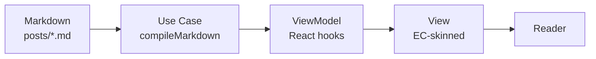

This is the canonical feature-reference post for the Scriptorium renderer. It exercises every supported Markdown feature at least once. Keep it — it is the ground truth for what the engine can do and serves as a live test that the renderer is healthy.

## Why this file exists

The Scriptorium engine reads this `posts/` folder, compiles each `.md` into a Hypertext AST, and the site renders the AST with the Elementary Complexity visual register. This file walks through every feature at least once.

## Prose, emphasis, and links

Markdown supports **strong**, *emphasis*, ~~strikethrough~~, `inline code`, and [links](https://elementarycomplexity.com). Footnotes work too[^1].

[^1]: Like this one. Footnotes ship with GFM and render as a numbered list at the bottom, with a return-anchor on each one.

## Lists

An unordered list:

- A point
- Another point
- A nested point
  - With a child
  - And another

An ordered list:

1. First step
2. Second step
3. Third step

A task list:

- [x] Scaffolded the writing repo
- [x] Built the Scriptorium engine
- [x] Scaffolded the writing repo
- [x] Built the Scriptorium engine
- [x] Confirmed this reference post renders correctly

## Blockquote

> The cathedral is built one stone at a time, not because the builder lacks tools, but because each stone has a place that only attention can find.

## Code

Inline code looks like `git push origin main`. Fenced code blocks get syntax highlighting via Shiki:

```typescript
export async function compileMarkdown(
  source: string,
  options?: CompileOptions
): Promise<CompiledMarkdown> {
  const tree = await unified()
    .use(remarkParse)
    .use(remarkFrontmatter, ['yaml'])
    .use(remarkGfm)
    .parse(source);

  return processTree(tree, options);
}
```

## Tables

| Layer       | Lives at                    | Imports React? | Portable? |
|-------------|-----------------------------|----------------|-----------|
| Use Case    | `lib/scriptorium/usecases/` | No             | Yes       |
| ViewModel   | `lib/scriptorium/viewmodels/` | Yes (hooks)   | Yes (port)|
| View        | `components/scriptorium/`   | Yes            | No        |

## Callouts (GFM alerts)

> [!NOTE]
> Use these for informational asides that aren't critical but help the reader.

> [!TIP]
> Use these to surface a small win or a non-obvious move.

> [!WARNING]
> Use these to flag traps and edge cases.

## Mermaid diagram



## Math

Inline: $E = mc^2$. Block:

$$
\sum_{i=0}^{n} x_i = \frac{n(n+1)}{2}
$$

## Auto-embed (bare URL on its own line)

A YouTube link alone on a line will render as a video player:

https://www.youtube.com/watch?v=dQw4w9WgXcQ

An X / Twitter link alone on a line will render as a static tweet card:

https://x.com/elco_coel/status/1234567890

## Iframe passthrough (the universal embed)

For any source not in the auto-embed list, paste its `<iframe>` directly. Hosts on the sanitize allowlist render through; everything else gets stripped. Example (replace with a real Loom / Spotify / NotebookLM URL):

<iframe src="https://www.loom.com/embed/abc123" allowfullscreen></iframe>

## Closing

When everything above renders correctly, the engine is healthy. Delete this file and write something real.
